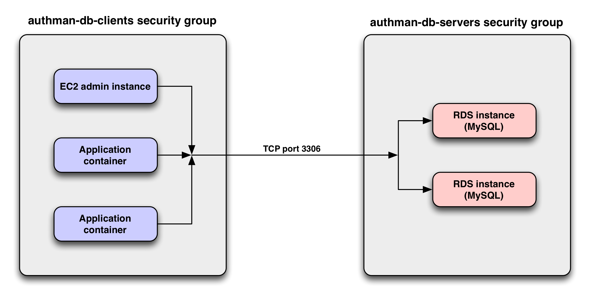

# client-server-security-group

[](https://drone.techservices.illinois.edu/techservicesillinois/terraform-aws-client-server-security-group)

Provides two security groups for use in client/server communications
on a given port. The client security group allows only outbound
connections to servers belonging to the server security group. The
server security group only allows inbound connections from clients
that are members of the client security group. This restricts server
access to only those clients in the client security group.

Example Usage
-----------------

```hcl
module "foo" {
  source = "git@github.com:techservicesillinois/terraform-aws-client-server-security-group"

  name_prefix = "authman-db"
  port        = 3306
  vpc         = "techservicesastest2-vpc"
}
```

Note: this will create two security groups: `authman-db-clients` and `authman-db-servers`.



The above graphic depicts a security group configuration for an RDS instance
running MySQL, and three clients, which may be EC2 instances, ECS containers,
and so forth.
Only clients that are members of the`authman-db-clients` security group are able to
establish a connection with the servers in the `authman-db-servers` security group,
and only on the designated port (3306 in this example).

Argument Reference
-----------------

The following arguments are supported:

* `port` - (Required) Server port
* `vpc` - (Required) The VPC name
* `name_prefix` - Prefix to prepend to autogenerated security group names
* `client_sg_name` - Client security group name (Ignored if name_prefix is set)
* `server_sg_name` - Server security group name (Ignored if name_prefix is set)
* `protocol` - Server protocol (e.g., icmp, tcp, udp) (Default: tcp)
* `tags` - Tags to be applied (A default `Name` tag is assigned using the security group name)

Attributes Reference
--------------------

The following attributes are exported:

* `client_security_group_id` - The ID of the client security group
* `client_security_group_name` - The name of the client security group
* `server_security_group_id` - The ID of the server security group
* `server_security_group_name` - The name of the server security group
